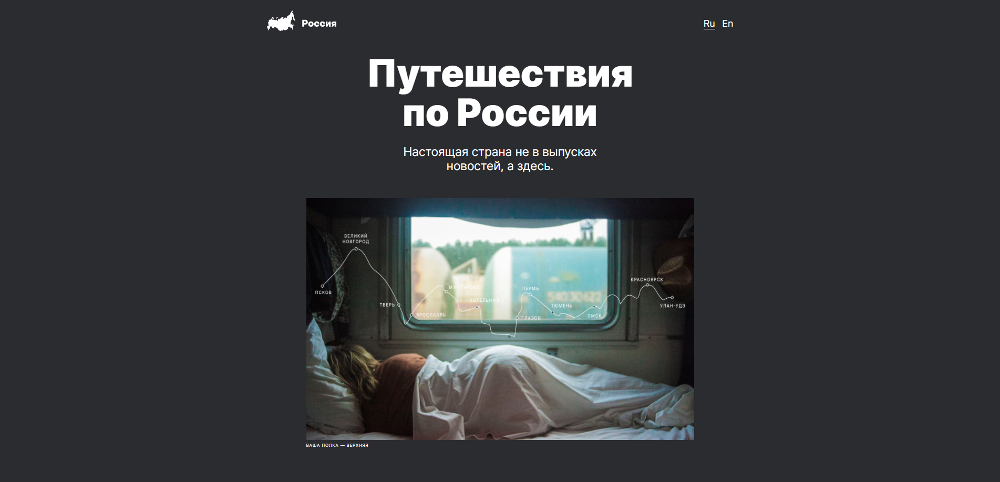

# Проект: Путешествие по России
Идея проекта - рассказать о местах, которые стоит посетить, путешествуя по России. Проект создан в рамках курса - Yandex.Practicum. 

**Используемые технологии**
* Flexbox
* Grid
* Медиазапросы
* БЭМ

**Ссылка на GitHub Pages**

[steanull.github.io/russian-travel/](https://steanull.github.io/russian-travel/)
